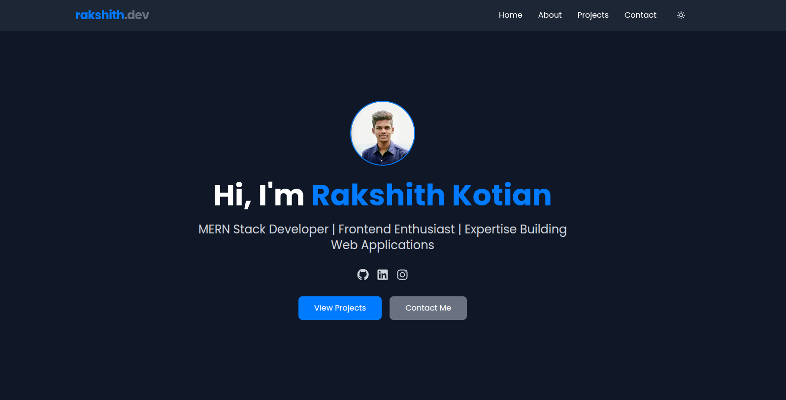

# 🚀 Personal Portfolio Website

This is my personal portfolio website built with **Next.js**, styled using **Tailwind CSS**, and enhanced with smooth animations via **Framer Motion**. It showcases my work, skills, and contact details in a modern and responsive design.

---

## 🛠️ Tech Stack

- **Next.js** – React framework for building fast and SEO-friendly web apps.
- **Tailwind CSS** – Utility-first CSS framework for custom styling.
- **Framer Motion** – Animation library for React with smooth transitions and interactions.
- **TypeScript** – For type safety and better developer experience.

---

---

## 💡 Features

- ⚡ Fast and responsive
- 🎨 Clean UI with Tailwind CSS
- ✨ Smooth animations using Framer Motion
- 📱 Fully responsive for all devices
- 🌙 Dark Mode 
- 🔗 Easy to customize and extend
- 📬 Contact form or contact section

---

## 🖥️ Live Demo

[🔗 Click here to view live site](https://rakshith-dev.vercel.app/)

---